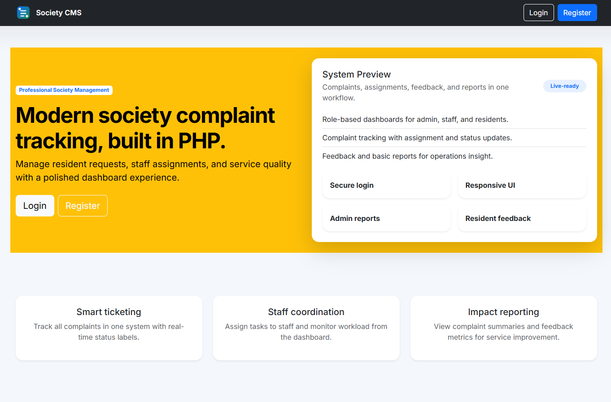
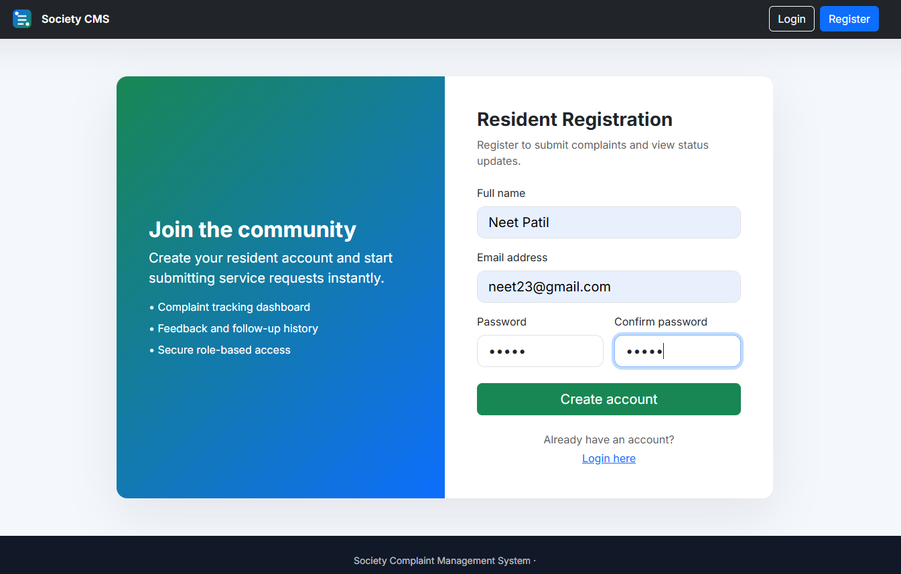
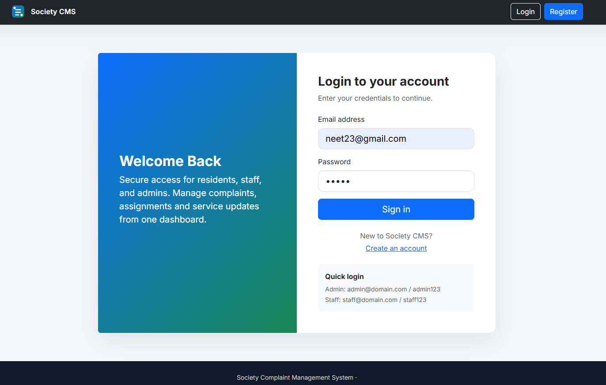
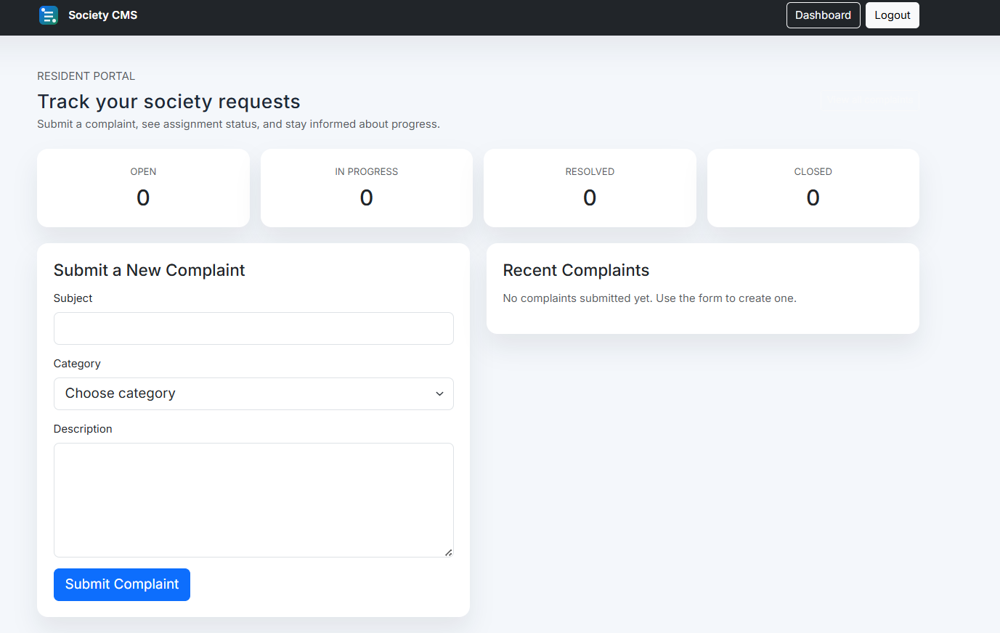
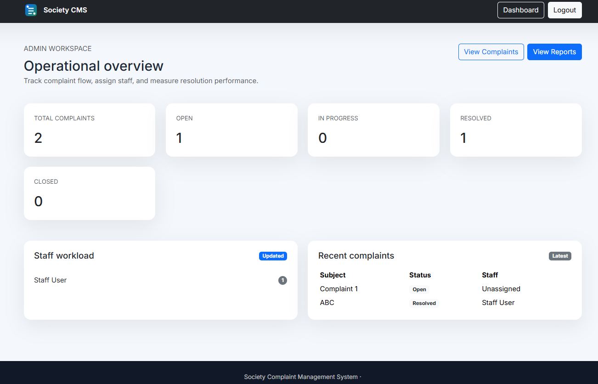
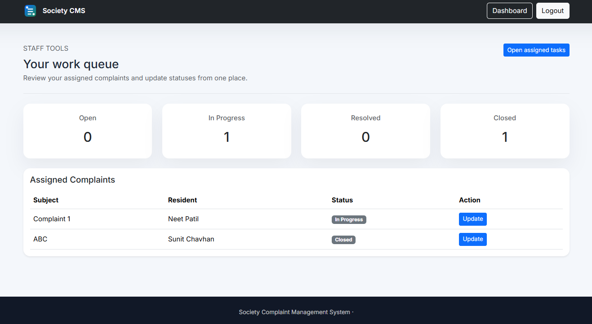
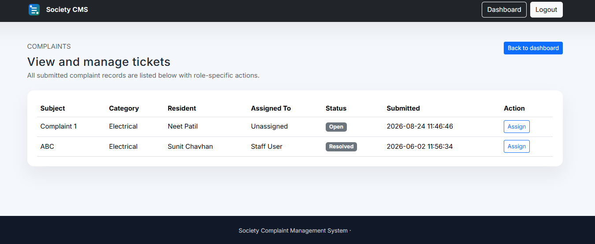

# Society Management System

A web-based society complaint management system that allows **Residents, Staff, and Admins** to manage and track complaints.

## Features

* Resident registration and login
* Submit and track complaints
* Admin complaint assignment
* Staff complaint handling
* Complaint status updates
* Resident feedback
* Admin reports

## Technologies Used

**PHP, MySQL, HTML, CSS, Bootstrap**

## Screenshots

### Home Page



### Register Page



### Login Page



### Resident Dashboard



### Admin Dashboard



### Staff Dashboard



### Complaint Management



## Setup

1. Install **XAMPP**.
2. Start **Apache** and **MySQL**.
3. Copy the project into `htdocs`.
4. Import `society_schema.sql` into MySQL/phpMyAdmin.
5. Open:

```text
http://localhost/Society%20Management%20System/
```

## Default Login

| Role  | Email              | Password   |
| ----- | ------------------ | ---------- |
| Admin | `admin@domain.com` | `admin123` |
| Staff | `staff@domain.com` | `staff123` |

Residents can create an account using the registration page.

## Project Structure

```text
Society Management System/
├── admin_dashboard.php
├── assign_complaint.php
├── complaints.php
├── db.php
├── feedback.php
├── login.php
├── register.php
├── reports.php
├── resident_dashboard.php
├── staff_dashboard.php
├── update_status.php
├── society_schema.sql
└── README.md
```

